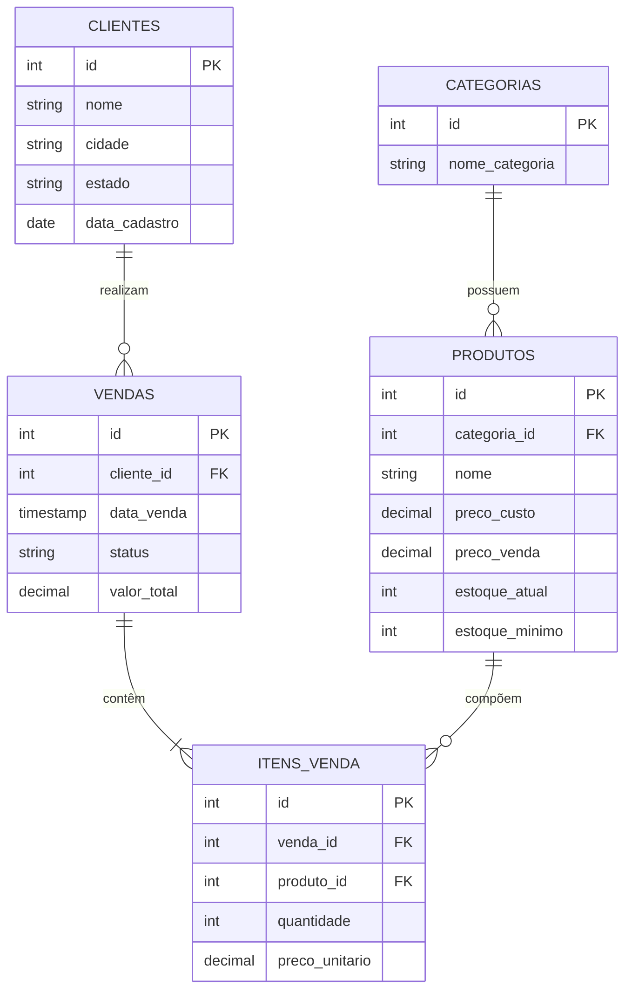

# Auto Analytics & Retail DB — Modelagem e Análise de Dados em SQL

Este projeto consiste na modelagem, implementação e análise de um banco de dados relacional para controle de vendas, clientes, catálogo de produtos e movimentação de estoque no setor de varejo/automotivo.

O objetivo principal é demonstrar a aplicação prática de SQL Avançado (Window Functions, CTEs, Joins complexos), Integridade Referencial, Automação via Triggers/Functions e Geração de KPIs de Negócio.

---

## Diagrama de Entidade-Relacionamento (DER)

Abaixo está o modelo conceitual de dados estruturado para suportar o fluxo completo desde a estocagem até o faturamento.



---

## Funcionalidades e Destaques Técnicos

* Modelagem Robusta (DDL): Aplicação de constraints de validação (CHECK), chaves primárias e estrangeiras configuradas com integridade referencial.
* Preservação de Preço Histórico: A tabela ITENS_VENDA armazena o valor unitário no momento da transação, garantindo consistência no histórico financeiro caso o produto mude de preço no cadastro principal.
* Consultas Analíticas e KPIs de Negócio (queries/):
  * Cálculo de crescimento mensal de faturamento (Month-over-Month) utilizando a Window Function LAG().
  * Ranking dos produtos mais vendidos por categoria utilizando DENSE_RANK() OVER (PARTITION BY ...).
  * Identificação de ruptura e alerta de estoque com cálculo estimado de custo de reposição.
* Automação e Integridade no Banco (automation/):
  * Triggers & Functions: Validação e baixa automática de estoque na inserção de novos itens, bloqueando vendas sem saldo disponível (RAISE EXCEPTION).
  * Recálculo automático do valor total da venda a cada alteração em seus itens.
  * View para BI: Abstração vw_resumo_vendas_detalhado pronta para integração com ferramentas como Power BI, Metabase ou Tableau.

---

## Como Executar o Projeto

### Pré-requisitos
* PostgreSQL (versão 12 ou superior) instalado localmente ou executado via container Docker.
* Um cliente SQL de sua preferência (DBeaver, pgAdmin, VS Code com extensão PostgreSQL, etc.).

### Ordem de Execução dos Scripts

Para montar o ambiente do zero com todas as automações e dados de teste, execute os scripts na ordem numérica dos diretórios:

1. Criação da Estrutura (DDL):
   psql -U seu_usuario -d seu_banco -f schema/01_create_tables.sql

2. Carga Inicial de Dados (DML):
   psql -U seu_usuario -d seu_banco -f schema/02_seed_data.sql

3. Automações (Views, Functions e Triggers):
   psql -U seu_usuario -d seu_banco -f automation/01_views_triggers.sql

4. Execução das Consultas Analíticas:
   psql -U seu_usuario -d seu_banco -f queries/01_kpi_vendas.sql

---

## Estrutura do Repositório

```
auto-analytics-sql/
│
├── schema/
│   ├── 01_create_tables.sql       # DDL: Estrutura do banco e restrições
│   └── 02_seed_data.sql           # DML: Povoamento com dados de teste
│
├── queries/
│   └── 01_kpi_vendas.sql          # Consultas analíticas, Window Functions e KPIs
│
├── automation/
│   └── 01_views_triggers.sql      # Views para BI e Triggers/Functions
│
└── README.md                      # Documentação completa do projeto
```